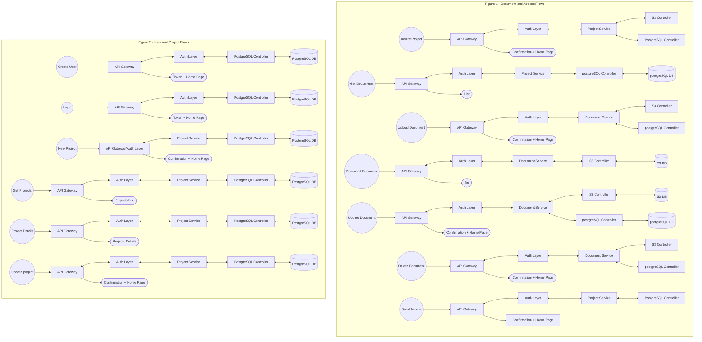

---
config:
  theme: redux
  layout: fixed
---

```mermaid
flowchart TB
  subgraph fig1["Figure 1 - Document and Access Flows"]
    a1(("Delete Project")) --> a2["API Gateway"]
    a2 <--> a3["Auth Layer"]
    a2 --> a48["Confirmation + Home Page"]
    a3 <--> a4["Project Service"]
    a4 <--> a5["S3 Controller"] & a7["PostgreSQL Controller"]
    a9(("Get Documents")) --> a10["API Gateway"]
    a10 <--> a11["Auth Layer"]
    a11 <--> a12["Project Service"]
    a12 <--> a13["postgreSQL Controller"]
    a13 <--> a49["postgreSQL DB"]
    a10 --> a14["List"]
    a15(("Upload Document")) --> a16["API Gateway"]
    a16 <--> a17["Auth Layer"]
    a16 --> a25["Confirmation + Home Page"]
    a17 <--> a18["Document Service"]
    a18 <--> a19["S3 Controller"] & a20["postgreSQL Controller"]
    a21(("Download Document")) --> a22["API Gateway"]
    a22 <--> a23["Auth Layer"]
    a22 --> a50["file"]
    a23 <--> a24["Document Service"]
    a24 <--> a26["S3 Controller"]
    a26 <--> a27["S3 DB"]
    a28(("Update Document")) --> a29["API Gateway"]
    a29 <--> a30["Auth Layer"]
    a30 <--> a31["Document Service"]
    a31 <--> a32["S3 Controller"] & a53["postgreSQL Controller"]
    a32 <--> a51[S3 DB]
    a53 <--> a54[postgreSQL DB]
    a29 --> a33["Confirmation + Home Page"]
    a34(("Delete Document")) --> a35["API Gateway"]
    a35 <--> a36["Auth Layer"]
    a35 --> a41["Confirmation + Home Page"]
    a36 <--> a37["Document Service"]
    a37 <--> a38["S3 Controller"] & a40["postgreSQL Controller"]
    a42(("Grant Access")) --> a43["API Gateway"]
    a43 <--> a44["Auth Layer"]
    a44 <--> a45["Project Service"]
    a45 <--> a46["PostgreSQL Controller"]
    a43 --> a52["Confirmation + Home Page"]
  end

  subgraph fig2["Figure 2 - User and Project Flows"]
    b4(("Create User")) --> b9["API Gateway"]
    b9 <--> b1["Auth Layer"]
    b9 --> b10["Token + Home Page"]
    b1 <--> b2["PostgreSQL Controller"]
    b2 <--> b3["PostgreSQL DB"]
    b5(("Login")) --> b8["API Gateway"]
    b8 <--> b6["Auth Layer"]
    b8 --> b11["Token + Home Page"]
    b6 <--> b7["PostgreSQL Controller"]
    b7 <--> b42["PostgreSQL DB"]
    b12(("New Project")) --> b13["API Gateway/Auth Layer"]
    b13 <--> b14["Project Service"]
    b13 --> b18["Confirmation + Home Page"]
    b14 <--> b17["PostgreSQL Controller"]
    b17 <--> b46["PostgreSQL DB"]
    b19(("Get Projects")) --> b20["API Gateway"]
    b20 <--> b21["Auth Layer"]
    b20 --> b43[Projects List]
    b21 <--> b22["Project Service"]
    b22 <--> b23["PostgreSQL Controller"]
    b23 <--> b25["PostgreSQL DB"]
    b27(("Project Details")) --> b28["API Gateway"]
    b28 <--> b29["Auth Layer"]
    b28 --> b44[Projects Details]
    b29 <--> b30["Project Service"]
    b30 <--> b31["PostgreSQL Controller"]
    b31 <--> b33["PostgreSQL DB"]
    b35(("Update project")) --> b36["API Gateway"]
    b36 <--> b37["Auth Layer"]
    b36 --> b45["Confirmation + Home Page"]
    b37 <--> b38["Project Service"] 
    b38 <--> b39["PostgreSQL Controller"]
    b39 <--> b40["PostgreSQL DB"]
  end

  a2@{ shape: proc}
  a3@{ shape: proc}
  a4@{ shape: proc}
  a5@{ shape: proc}
  a7@{ shape: proc}
  a10@{ shape: proc}
  a11@{ shape: proc}
  a12@{ shape: proc}
  a13@{ shape: proc}
  a14@{ shape: terminal}
  a16@{ shape: proc}
  a17@{ shape: proc}
  a18@{ shape: proc}
  a19@{ shape: proc}
  a20@{ shape: proc}
  a25@{ shape: terminal}
  a22@{ shape: proc}
  a23@{ shape: proc}
  a24@{ shape: proc}
  a26@{ shape: proc}
  a27@{ shape: db}
  a29@{ shape: proc}
  a30@{ shape: proc}
  a31@{ shape: proc}
  a32@{ shape: proc}
  a33@{ shape: terminal}
  a35@{ shape: proc}
  a36@{ shape: proc}
  a37@{ shape: proc}
  a38@{ shape: proc}
  a40@{ shape: proc}
  a41@{ shape: terminal}
  a43@{ shape: proc}
  a44@{ shape: proc}
  a45@{ shape: proc}
  a46@{ shape: proc}
  a48@{ shape: terminal}
  a49@{ shape: db}
  a50@{ shape: terminal}
  a51@{ shape: db}
  a53@{ shape: proc}
  a54@{ shape: db}

  b1@{ shape: proc}
  b2@{ shape: proc}
  b3@{ shape: cyl}
  b9@{ shape: rect}
  b10@{ shape: terminal}
  b6@{ shape: proc}
  b7@{ shape: proc}
  b8@{ shape: rect}
  b11@{ shape: terminal}
  b13@{ shape: rect}
  b14@{ shape: rect}
  b17@{ shape: proc}
  b18@{ shape: terminal}
  b20@{ shape: rect}
  b21@{ shape: proc}
  b22@{ shape: rect}
  b23@{ shape: proc}
  b25@{ shape: cyl}
  b28@{ shape: rect}
  b29@{ shape: proc}
  b30@{ shape: rect}
  b31@{ shape: proc}
  b33@{ shape: cyl}
  b36@{ shape: rect}
  b37@{ shape: proc}
  b38@{ shape: rect}
  b39@{ shape: proc}
  b40@{ shape: cyl}
  b42@{ shape: cyl}
  b43@{ shape: terminal}
  b44@{ shape: terminal}
  b45@{ shape: terminal}
  b46@{ shape: db}
```
