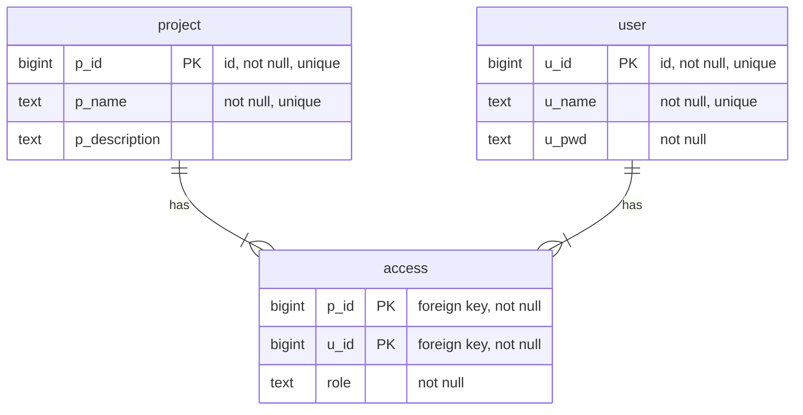

# DataBase Design
## Info-logical design
### Defining:
1. Entities
2. Attributes
3. Comments

### Entities
* User
* Project
* Document
* Project Access / Membership (Association relation)

### Entity/Attributes
#### User
* Username -> username (NOT NUL, UNIQUE)
* Password -> password (NOT NULL)
* User ID: <PK> -> user_id (auto, UNIQUE, NOT NULL)

#### Project
* Project Name -> project_name (UNIQUE, NOT NULL)
* Project Description -> project_description
* Project ID <PK> -> project_id (UNIQUE, auto, NOT NULL)

#### Document (S3)
* Project ID
* Object

#### Project Access / Membership (Association relation - User & Project)
* Project ID -> project_id (<PfK>)
* User ID -> user_id (<PfK>)
* Role -> role (USER | ADMINISTRATOR)

## Data-logical design
### Defining
1. DBMS Conventions
    DBMS Type
    particular DBMS
    minimal DBMS version
    DBMS infrastructure details
2. Naming conventions
    Structures naming
    SQL code formating
    Comments principles
    Other specifics
3. Table Description
    Database table
    Database table fields
    Data type
    Comments

## DBMS Conventions
DBMS Type: Relational Database
Particular DBMS: PostgreSQL
minimal DBMS version: 18.4
DBMS Infrastructure details: self-hosted

## Naming Conventions
1. Structures naming
	a. All table and field names must be lowercase only.
	b. Word separator in table and field names must be “_” only.
	c. Nouns in table names must be in singular form only (e.g., “file”, NOT “files”). Nouns in field names   may be un plural form (still its not recommended).
	d. Field names must have prefixes composed with beginning table name letters.
	e. All unique constraint names must have “UNQ_” prefix, and must contain all corresponding fields names.
	f. All trigger names must have “TRG_”, and must contain the table name and triggering event name.
2. SQL code formatting:
	a. All SQL keywords must be in uppercase.
	b. All structure names must be enclosed in “`” symbols.
3. Comment Principles
    a. All database structures mut have a comment.
4. Other specifics (like API, and so on):
	a. All datetime fields must be of INTEGER type and store UNIXTIME-values.
	b. All date fields must be of DATE type.
	c. All primary keys must be surrogate, auto-increment, unsigned

## Table Description
