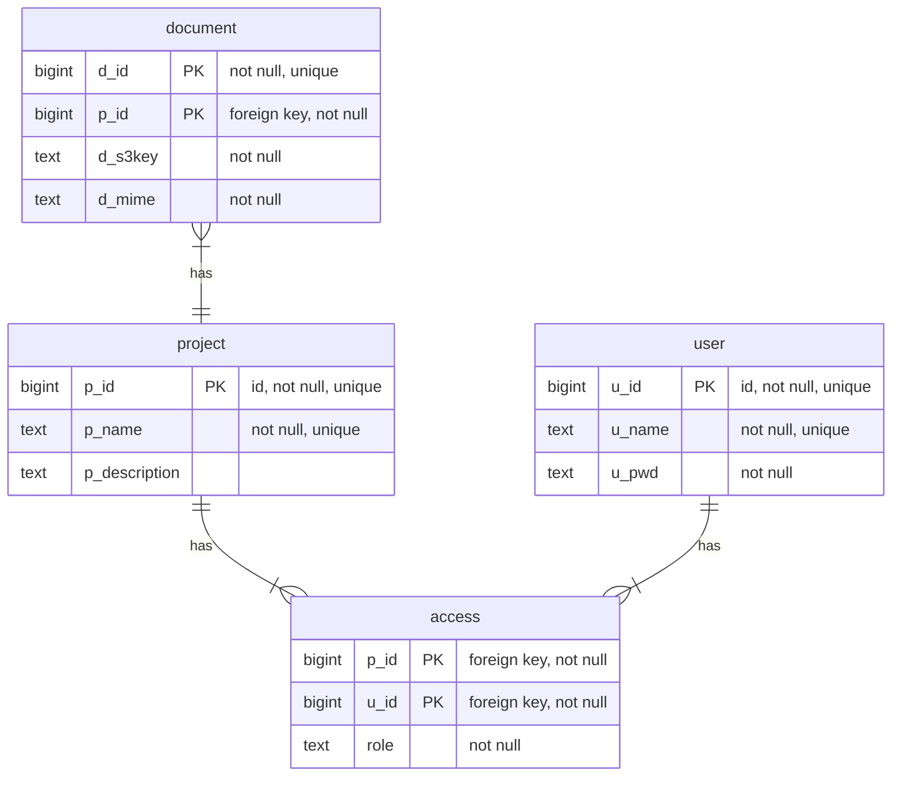

# DataBase Design
## Info-logical design
### Defining:
1. Entities
2. Attributes
3. Comments

### Entities
* User
* Project
* Document
* Project Access / Membership (Association relation)

### Entity/Attributes
#### User
* Username -> u_ser_name (NOT NUL, UNIQUE)
* Password -> u_pwd (NOT NULL)
* User ID: <PK> -> u_id (auto, UNIQUE, NOT NULL)

#### Project
* Project Name -> p_name (UNIQUE, NOT NULL)
* Project Description -> p_description
* Project ID <PK> -> p_id (UNIQUE, auto, NOT NULL)

#### Document
* Document ID -> d_id (UNIQUE, NOT NULL)
* Project ID -> p_id (fK)
* S3 Key -> d_s3key
* mime type -> d_mime

#### Project Access / Membership (Association relation - User & Project)
* Project ID -> project_id (<PfK>)
* User ID -> user_id (<PfK>)
* Role -> role (USER | ADMINISTRATOR)

## Data-logical design
### Defining
1. DBMS Conventions
    DBMS Type
    particular DBMS
    minimal DBMS version
    DBMS infrastructure details
2. Naming conventions
    Structures naming
    SQL code formating
    Comments principles
    Other specifics
3. Table Description
    Database table
    Database table fields
    Data type
    Comments

## DBMS Conventions
DBMS Type: Relational Database
Particular DBMS: PostgreSQL
minimal DBMS version: 18.4
DBMS Infrastructure details: self-hosted

## Naming Conventions
1. Structures naming
	a. All table and field names must be lowercase only.
	b. Word separator in table and field names must be “_” only.
	c. Nouns in table names must be in singular form only (e.g., “file”, NOT “files”). Nouns in field names   may be un plural form (still its not recommended).
	d. Field names must have prefixes composed with beginning table name letters.
	e. All unique constraint names must have “UNQ_” prefix, and must contain all corresponding fields names.
	f. All trigger names must have “TRG_”, and must contain the table name and triggering event name.
2. SQL code formatting:
	a. All SQL keywords must be in uppercase.
	b. All structure names must be enclosed in “`” symbols.
3. Comment Principles
    a. All database structures mut have a comment.
4. Other specifics (like API, and so on):
	a. All datetime fields must be of INTEGER type and store UNIXTIME-values.
	b. All date fields must be of DATE type.
	c. All primary keys must be surrogate, auto-increment, unsigned

## Table Description

## Permissions applied at database layer
Admin or users of the project specific.

| Permissions                                   | User | Admin |
| Create/Delete Projects                        | No   | Yes |
| Add/Update Project Information and Details    | Yes  | Yes | 
| Add/Update/Remove Project Documents           | Yes  | Yes | 
| Share Project with Other Users                | No   | Yes |

## Implemented Database Extensions (postgres_db_setup.py)

### 1. Additional Structures Implemented
The database setup script adds the following structures to support security, consistency, and performance:

* `app_user` table (used instead of reserved keyword `user`)
    * `u_id` (identity PK)
    * `u_name` (unique username)
    * `u_pwd` (password hash)
    * `u_created_at`, `u_updated_at` (UNIXTIME BIGINT)
* `project` table
    * `p_created_at`, `p_updated_at` (UNIXTIME BIGINT)
* `project_access` table (membership and project role)
    * composite PK (`p_id`, `u_id`)
    * `pa_role` (`user` | `administrator`)
    * `granted_by_u_id`, `pa_created_at`, `pa_updated_at`
* `project_document` table
    * `d_id` identity PK
    * `p_id` FK to project
    * `d_title`
    * `d_s3key` (unique), `d_mime`
    * `d_uploaded_by_u_id`, `d_created_at`, `d_updated_at`

### 2. Cascade Operations and Referential Actions
To keep consistency automatically:

* Deleting a project cascades to `project_access` and `project_document`.
* Deleting a user cascades to `project_access` memberships.
* If uploader/granter users are deleted, references are set to NULL (`ON DELETE SET NULL`) instead of deleting records.
* There is currently no owner FK column in `project`; ownership is represented by initial `project_access` administrator assignment.

### 3. Advanced Indexing for Performance
The setup script includes indexes optimized for the expected API queries:

* `idx_project_access_u_id_p_id` for membership lookup by user/project.
* `idx_project_p_id` on `project(p_id)`.
* `idx_project_document_p_id` on `project_document(p_id)`.
* `idx_project_document_u_id` on `project_document(u_id)`.
* `idx_username_trgm` (GIN + `pg_trgm`) for username search.

### 4. Trigger-Based Data Integrity
Implemented triggers:   

* Auto-update `*_updated_at` timestamps on UPDATE for all main tables.
* Guard trigger preventing removal/demotion of the last project administrator.

This enforces the rule that each project must always keep at least one administrator.

### 5. Stored Procedures / Functions Implemented
Controller use cases are mapped to DB-side procedures with permission checks:

* `sp_create_project(p_requester_u_id, p_name, p_description)`
* `sp_get_projects_by_u_id(p_requester_u_id, p_target_u_id)`
* `sp_create_user(p_requester_u_id, p_u_ser_name, p_plain_pwd)`
* `sp_check_u_pwd(p_u_id, p_plain_pwd)`
* `sp_get_project_details(p_requester_u_id, p_p_id)`
* `sp_update_project(p_requester_u_id, p_p_id, p_name, p_description)`
* `sp_delete_project(p_requester_u_id, p_p_id)`
* `sp_get_documents(p_requester_u_id, p_p_id)`
* `sp_change_role(p_requester_u_id, p_p_id, p_target_u_id, p_new_role)`

Additional document management helpers included in the implementation:

* `sp_upsert_document(p_requester_u_id, p_p_id, p_d_id, p_d_s3key, p_d_title, p_d_mime)`
* `sp_remove_document(p_requester_u_id, p_p_id, p_d_id)`

### 6. Authorization Model Enforced in SQL
Permission checks are centralized in helper functions:

* `fn_require_project_member(...)`
* `fn_require_project_admin(...)`

Effective behavior:

* Create project: any authenticated user (becomes initial project administrator in `project_access`).
* Delete project: project administrator.
* Update project info/details: any project member.
* Add/update/remove project documents: any project member.
* Share project / change roles: project administrator only.
* Read project details/documents: any project member.

Current SQL-side self-check behavior:

* `sp_get_projects_by_u_id` allows only self-query (`p_requester_u_id = p_target_u_id`).

### 7. Password Security
Passwords are not stored in plain text:

* `sp_create_user` stores passwords with bcrypt hash using `pgcrypto` (`crypt` + `gen_salt('bf')`).
* `sp_check_u_pwd` validates password attempts against stored hash.
