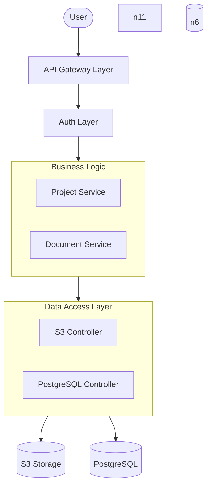
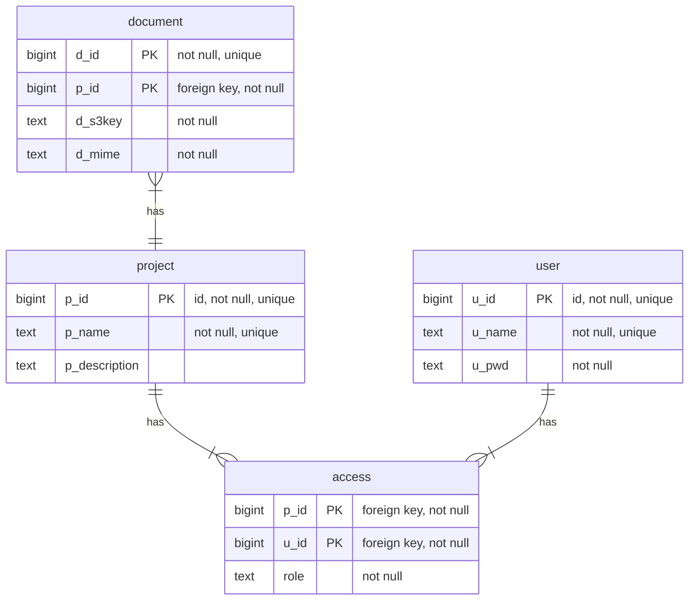
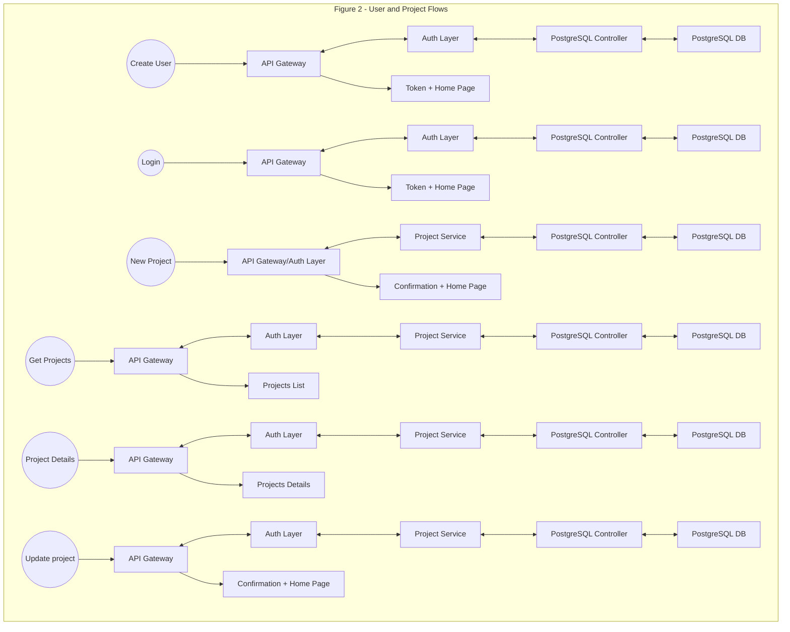
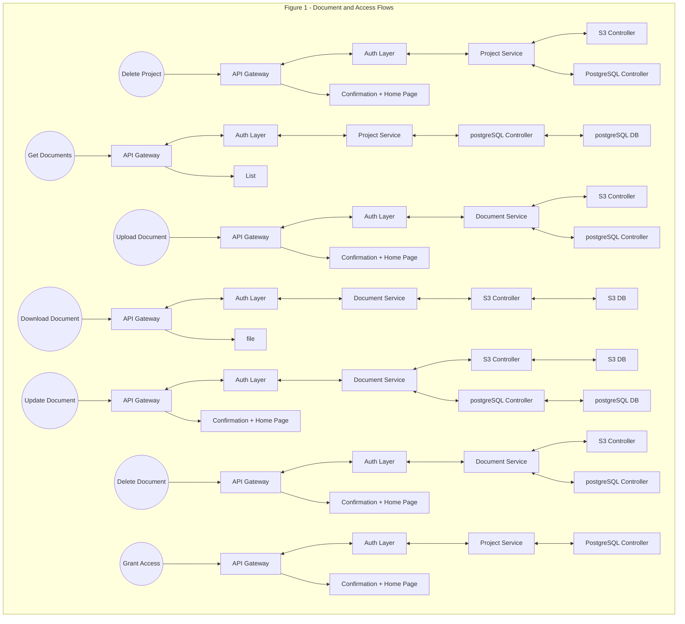

# Project Manager App
## Apendix:
1. Executive Summary
2. Requirements
3. High-Level Architecture Diagram
4. Technology Stack
5. Data Model
6. Authentication & Authorization
7. API Design
8. Deployment Diagram
9. Architectural Decisions

## Executive Summary
Project Management/profiles dashboard.
A service to create, update, share, and delete projects information (details, attached
documents).

## Requirements
1. User login/auth
2. Create/Delete projects
3. Add/Update project’s info/details - name, description
4. Add/Update/Remove projects documents (docx, pdf)
5. Share project with other users to access

## High-level Architecture Diagram

### Request Flow
1. User sends HTTPS request
|
v
2. API Gateway receives the request
|
v
3. Authentication Layer
- Validates JWT token
- Authenticates user
- Extracts user claims
|
v
4. Request is routed to the corresponding service
- Project Service
- Document Service
|
v
5. Service executes business rules
|
v
6. Service accesses required storage through
the Data Access Layer
|
+--> PostgreSQL
|
+--> Key-Value Storage
|
+--> S3 Storage
|
v
7. Data is returned to the service
|
v
8. Service builds response
|
v
9. Response flows back through:
Service -> Gateway -> User

### Component Responsibilities
| Layer | Responsibility |
|--------|---------------|
| User | Consumes the application |
| API Gateway | Entry point, routing, HTTPS handler |
| Authentication Layer | User authentication, JWT validation, identity extraction |
| Project Service | Project management business rules |
| Document Service | Document management, upload, retrieval, processing |
| Data Access Layer | Abstracts persistence technologies from business services |
| PostgreSQL Adapter | Relational data access |
| Key/Value Adapter | Project documents quick access |
| S3 Controller | Object storage integration |
| PostgreSQL | Structured persistent data |
| Key-Value Storage | High-performance non-relational storage |
| S3 Storage | Document and file storage |

## Technology Stack
- Python 3.12+
- FastAPI
- PostgreSQL +Optional ORM (SQLAlchemy)
- Docker
- AWS S3 (file storage)
- AWS lambda functions (for image processing, size calculations on s3 event)
- CI/CD Github Actions/Gitlab CI (testing/linting/building/pushing to registry/deploy to
cloud on merge request)

## Data Model
PostgreSQL DB -
Stores relational data from users, projects, roles and document's metadata. It maintains strong consistency, strict
schema and ensures data integrity
AWS S3 -
For document storage.
Documents will be stored as objects, adding support for multiple formats along with its
metadata. Documents will be assigned to buckets and each bucket will be a project.

## Authentication & Authorization
### Authentication Flow

User
|
Login
|
Auth Service
|
JWT Token

### Authorization

- Roles:
User
Admin

- Permissions
| Action | User | Admin |
|---------|------|-------|
| Create/Delete Projects | No | Yes |
| Add/Update Project Information and Details | Yes | Yes |
| Add/Update/Remove Project Documents | Yes | Yes |
| Share Project with Other Users | No | Yes |

API Design
1. 2. 3. 4. 5. 6. 7. 8. 9. 10. 11. 12. 
1. POST /auth - Create user (login, password, repeat password)
2. POST /login - Login into service (login, password)
3. POST /projects - Create project from details (name, description). Automatically gives access to
    created project to user, making him the owner (admin of the project).
4. GET /projects - Get all projects, accessible for a user. Returns list of projects full info(details +
    documents).
5. GET /project/<project_id>/info - Return project’s details, if user has access
6. PUT /project/<project_id>/info - Update projects details - name, description. Returns the updated
    project’s info
7. DELETE /project/<project_id>- Delete project, can only be performed by the projects’ owner.
    Deletes the corresponding documents
8. GET /project/<project_id>/documents- Return all of the project's documents
9. POST /project/<project_id>/documents - Upload document/documents for a specific project
10. GET /document/<document_id> - Download document, if the user has access to the corresponding
    project
11. ** PUT /document/<document_id> - Update document
12. DELETE /document/<document_id> - Delete document and remove it from the corresponding
    project
13. POST /project/<project_id>/invite?user=<login> - Grant access to the project for a specific user.
    If the request is not coming from the owner of the project, results in error. Granting access gives
    participant permissions to receiving user

User and Project flows

Document and Access Flows

## Deployment Diagram
Following the 3 layer style
⁃ Data Access Object
⁃ Models
⁃ Routes
⁃ Services
⁃ main.py

### Folder Structure
project_manager/
│
|── app/
│ |── main.py
│ |── services/
│ |── models/
| |── routes/
│ └── dao/
│—— documents/
│
|── Dockerfile
|── docker-compose.yml
|── .env
|── .gitignore
|── README.md

The application will run in a single container, as it will be deployed as monolithic.
The internal architecture is designed as separated blocks for future service
extraction in case the application grows and one service becomes a bottleneck.

### Container Diagram

Internet
|
API Gateway
|
+———————————+
| FastAPI Application |
|——————————— |
| Project Module |
| Document Module |
| Authentication Module |
+———————————+
|
+ —> PostgreSQL
+ —> key/value
+ —> S3

## Security Considerations
OAuth2 -
Used for Authorization standard flow, allows easy extraction of authentication headers from
requests and use of tokens with a expiration time. The Authentication module is the owner for
this entire process.
JWT -
Used to encrypt the authorization data for OAuth2 processes. It is easy to implement in
FastAPI allowing fast extraction from the same container instead of checking user identity on
every request.
DB Security -
Every DBMS will its own layer of security, only specific roles can do certain type of actions.
NGINX -
Used for HTTPS decoding/encoding. HTTPS avoids external users intercept or stole critical
information with SSL/TLS certificates.